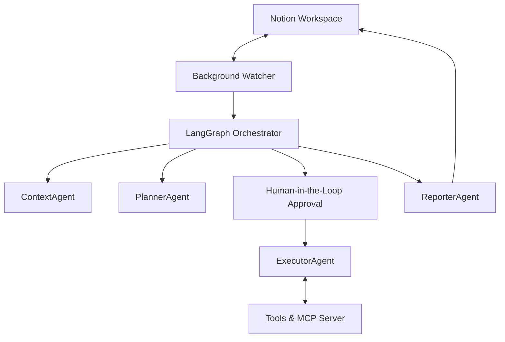

# NotionOS: The AI-Native Operating System for Notion

NotionOS transforms Notion from a passive documentation tool into an executable operational layer. Built on the **Model Context Protocol (MCP)** and powered by **LangGraph**, it enables autonomous AI agents to plan, coordinate, and safely execute work across multiple tools while remaining grounded in your workspace context.

---

## 🚀 Vision
*“Use Notion as the human-facing operational layer while AI agents interpret, execute, coordinate, and report work in the background.”*

Instead of context-switching between tools, NotionOS treats Notion as your cockpit. Create a task, mark it as Pending, and watch as the system interprets your intent, proposes a plan for approval, and executes it across GitHub, Gmail, and the web.

---

## 🏗️ Architecture


```mermaid
graph TD
    A[Notion Workspace] <--> B[Background Watcher]
    B --> C[LangGraph Orchestrator]
    C --> D[ContextAgent]
    C --> E[PlannerAgent]
    C --> F[Human-in-the-Loop Approval]
    F --> G[ExecutorAgent]
    G <--> H[Tools & MCP Server]
    C --> I[ReporterAgent]
    I --> A
```

### Key Engineering Pillars
1. **Deep MCP Integration**: Uses an MCP-first hybrid architecture. The system natively spawns the official `@notionhq/notion-mcp-server` to interact with your workspace as a set of structured tools.
2. **Human-in-the-Loop (HITL)**: Safety is built-in. Every execution plan must be approved via the Notion page or the live Dashboard before side-effects occur.
3. **Multi-Agent Orchestration**: Specialized agents (Context, Planner, Executor, Reporter) isolate responsibilities to ensure robust execution and detailed reporting.
4. **Real-Time Observability**: A dedicated Next.js dashboard streams execution logs, tool inputs/outputs, and state transitions via WebSockets.

---

## 🛠️ Tech Stack
- **Frontend**: Next.js 15, React 19, TypeScript, Tailwind CSS 4.
- **Backend**: FastAPI (Python), SQLAlchemy (SQLite/PostgreSQL).
- **Agent Orchestration**: LangGraph, LangChain.
- **AI Models**: Groq (Llama 3.3 70b) for speed, Google (Gemini 2.0 Flash) for complex fallback.
- **Protocol**: Model Context Protocol (MCP) via stdio transport.

---

## 🏁 Quick Start

### 1. Prerequisites
- Python 3.10+
- Node.js 18+
- Notion Internal Integration Token
- Groq or Google Gemini API Key

### 2. Environment Setup
Copy `.env.example` to `.env` and fill in your keys:
```bash
NOTION_API_KEY=your_token
NOTION_DATABASE_ID=your_db_id
GROQ_API_KEY=your_key
GEMINI_API_KEY=your_key
```

### 3. Installation
```bash
# Install backend dependencies
cd backend
pip install -r requirements.txt

# Install frontend dependencies
cd ../frontend
npm install
```

### 4. Running the System
```bash
# Start the Backend (starts the MCP server & Watcher automatically)
cd backend
python -m uvicorn main:app --reload

# Start the Frontend
cd ../frontend
npm run dev
```

---

## 🤖 Integrated Tools
- **GitHub**: Repository creation, issue management, and automated Pull Requests.
- **Search**: Tavily-powered web research and extraction.
- **Browser**: Playwright-based form filling and web interaction.
- **Notion**: Status management, block appending, and workspace context retrieval.

---

## 🛡️ Safety & Reliability
- **Synchronous Gating**: Prevents race conditions and duplicate task execution.
- **State Persistence**: Every step is logged to a local database for full auditability.
- **Hybrid Mode**: Automatic fallback to REST API if the MCP layer is unavailable.

---

## 📝 License
MIT
